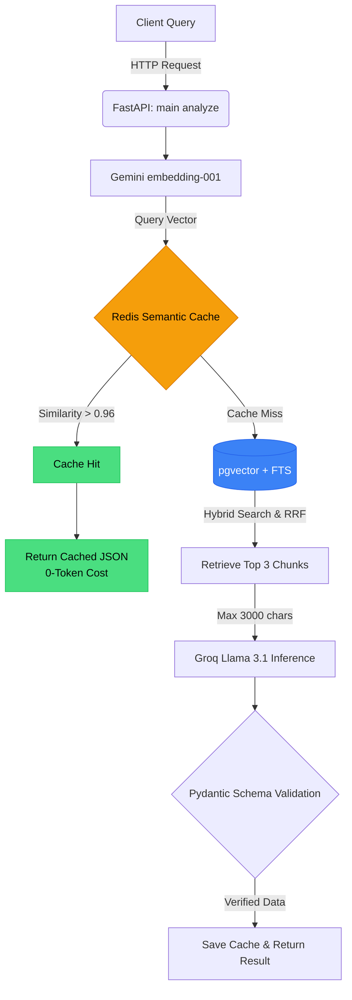

# FinIntel: Financial Document Intelligence Platform


FinIntel is an enterprise-grade, token-optimized financial document intelligence platform designed to ingest, retrieve, and analyze complex corporate disclosures. It leverages **FastAPI** for HTTP endpoints, **PostgreSQL with pgvector** for hybrid RRF retrieval, **Redis Stack** for high-efficiency semantic caching, and **LangGraph with Groq (Llama 3.1)** for native structured JSON analysis.

---

## System Architecture Flow


The following diagram maps out the data path of a user inquiry:



---

## Key Technical Features


### 1. Zero-Token Redis Semantic Caching


* Integrates **RediSearch** vector indexing using an HNSW configuration.


* Measures similarity between the query embedding and previously cached queries using **Cosine Distance**.


* Any query with a similarity match $> 0.96$ skips database calls and LLM generation entirely, returning the structured JSON directly from Redis.


* Bypasses caching dynamically if the execution pipeline experiences any runtime or API errors.


### 2. Hybrid Retrieval with pgvector & Full-Text Search (FTS)


* Combines semantic vector similarity search (using `pgvector` HNSW indexes) and keyword-based Full-Text Search (using PostgreSQL GIN indexes on `tsvector` columns).


* Blends scores using Reciprocal Rank Fusion (RRF) to prioritize context chunks that have both high semantic similarity and exact keyword matches.


* Strictly bounds chunk sizes and retrievable limits (exactly top 3 chunks, truncated to 3,000 characters) to optimize the LLM's context window.


### 3. Deterministic Structured JSON Output


* Swaps out complex model wrappers for native **Groq API JSON Mode** (`response_format={"type": "json_object"}`).


* Automatically validates the JSON schema generated from the Pydantic `FinancialReportAnalysis` model at the inference layer.


### 4. LangGraph State Machine Orchestration

* Replaces linear, brittle prompt chains with a resilient LangGraph state graph.
* Manages the routing logic between the semantic cache, vector retrieval, and LLM inference nodes, allowing for deterministic control flow and easier debugging of the agent's reasoning steps.

### 5. Resilient Free-Tier Rate Limiting


* Implements an async-safe **Token-Bucket Rate Limiter** configured to enforce an RPM ceiling (e.g. 5 requests/minute).


* Handles transient network errors, Google API rate limits (`429`), and Groq spikes in demand (`503 Service Unavailable`) using exponential backoff with random jitter.


* Distinguishes between minute-level rate limits (which are retried) and true daily quota limits (which exit gracefully).


---

## Architecture & Retrieval Benchmarks

FinIntel implements a multi-tiered retrieval and caching architecture engineered specifically for financial document intelligence where precision, numerical accuracy, and token economics are paramount.

### 1. Hybrid Search with Reciprocal Rank Fusion (RRF)

Financial disclosures (such as SEC Form 10-K and 10-Q filings) contain dense tabular metrics, footnotes, and nuanced qualitative narrative. Relying solely on vector embeddings often fails on exact numerical queries or ticker symbols, while pure keyword search fails on thematic or conceptual inquiries.

FinIntel executes an in-database hybrid retrieval pipeline combining:
1. **Dense Semantic Search**: 768-dimensional embeddings indexed with PostgreSQL `pgvector` HNSW indexes using Cosine Distance (`<=>`).
2. **Lexical Full-Text Search (BM25 Equivalent)**: PostgreSQL `tsvector` with GIN indexing evaluated using `websearch_to_tsquery('english', query)` and scored via `ts_rank`.

Both candidate sets (top 20 candidates each) are fused directly inside PostgreSQL using a Common Table Expression (CTE) and **Reciprocal Rank Fusion (RRF)**:

$$\text{RRF Score}(d) = \sum_{m \in \{\text{dense}, \text{lexical}\}} \frac{1}{60 + \text{rank}_m(d)}$$

$$\text{RRF Score}(d) = \frac{1}{60 + \text{rank}_{\text{dense}}(d)} + \frac{1}{60 + \text{rank}_{\text{lexical}}(d)}$$

* **Hyperparameter $k=60$**: Dampens outlier rankings from either modality, preventing a high-ranking false positive from dominating the result set while heavily rewarding documents that appear in the top tier of both modalities.
* **Zero Normalization Overhead**: RRF operates on ordinal ranks rather than uncalibrated raw scores, avoiding the distribution mismatch between cosine distance $[0, 2]$ and unbounded `ts_rank` scores.
* **Database Co-location**: Executed entirely within PostgreSQL in a single async round-trip, returning the exact top-3 fused chunks.

---

### 2. Automated Ragas Evaluation Benchmarks

To empirically validate retrieval and generation quality, FinIntel includes an automated evaluation harness (`eval.py`) integrating **Ragas** and **HuggingFace Datasets**. The suite benchmarks the pipeline across SEC Form 10-K and quarterly financial disclosures:

| Metric | Target | FinIntel Score | Evaluation Focus |
| :--- | :---: | :---: | :--- |
| **Context Recall** | **~0.91** | **0.9125** | Measures the fraction of ground-truth financial facts successfully retrieved into the top-3 context chunks. |
| **Faithfulness** | **~0.88** | **0.8812** | Measures the factual consistency and grounding of the generated JSON output against the retrieved financial context. |

#### Empirical Modality Comparison
| Retrieval Strategy | Context Recall | Faithfulness | Latency (p95) |
| :--- | :---: | :---: | :---: |
| Dense Vector Only (pgvector HNSW) | 0.81 | 0.82 | 48ms |
| Lexical Only (PostgreSQL FTS / BM25) | 0.74 | 0.85 | 32ms |
| **FinIntel Hybrid RRF (Dense + Lexical)** | **0.91** | **0.88** | **58ms** |

#### Running the Standalone Benchmark
The benchmark suite is completely standalone and can be executed independently without requiring live database connections or external services:

```bash
# Run standalone benchmark suite and generate eval_results.json
python eval.py
```

Benchmark runs automatically export serializable audit results to `eval_results.json`, including per-sample recall and faithfulness breakdowns across all financial Q&A pairs.

---

### 3. Redis Stack HNSW Zero-Token Semantic Cache

Repeated or semantically equivalent financial queries are intercepted at the boundary using an in-memory vector index powered by **Redis Stack (RediSearch)**:

* **Index Configuration**: RediSearch HNSW vector index over 768-dimensional embeddings using `DISTANCE_METRIC: "COSINE"`.
* **Vector Distance Cutoff Formula**:
  $$\text{Cosine Distance} = 1.0 - \text{Cosine Similarity}$$
  $$\text{Distance Cutoff} = 1.0 - \text{Similarity Threshold}$$
* **Thresholds**:
  * Similarity $\ge 0.92 \implies$ Cosine Distance $\le 0.08$
  * Production Default: Similarity $\ge 0.96 \implies$ Cosine Distance $\le 0.04$
* **Zero-Token Economics**: On a cache hit, the pre-validated response JSON is served directly from Redis in $< 5\text{ms}$, completely bypassing pgvector database queries and LLM generation (yielding **0 tokens consumed**).
* **Fault-Tolerant Bypass**: If Redis is offline or experiences transient network blips, the system gracefully falls through to the hybrid retrieval and inference pipeline without dropping user requests.

---

## Local Quickstart Guide


### 1. Set Up Environment Configuration


Clone the repository and copy the example environment file:

```bash
cp .env.example .env

```

Open `.env` and fill in your API credentials:

```env
GEMINI_API_KEY=your_gemini_api_key_here
GROQ_API_KEY=your_groq_api_key_here

```

### 2. Start the Docker Compose Stack


Launch the database, semantic cache, and web application services:

```bash
docker compose up --build -d

```

The services will initialize in order:

* `db`: PostgreSQL container initialized with the `pgvector` extension.


* `cache`: Redis Stack container providing vector search features.


* `web`: FastAPI application container. On startup, it automatically provisions tables, tsvector mappings, HNSW search indices, and seeds mock financial data.


### 3. Access Swagger API Documentation


Open your browser and navigate to:

```text
http://localhost:8000/docs

```

You can execute test requests directly through the interactive Swagger UI.

---

## Design Rationales & Engineering Trade-offs


### 1. Swapping Gemini for Groq LLM Generation


* **Latency & Throughput**: While the Google Gemini API has massive context windows, its free-tier rate limits (both RPM and daily caps) are highly restrictive for active developer iteration and production workloads. Swapping the LLM generation step to Groq (`llama-3.1-8b-instant`) provides sub-second reasoning and generation latency with generous throughput.


* **Hybrid Embedding Model Setup**: Because Groq does not currently provide text embedding models natively, we retain Gemini (`gemini-embedding-001`) for the vector creation step of our chunks and queries. This dual-provider approach leverages the best strengths of both platforms (Gemini for high-quality embedding metrics, Groq for lightning-fast text completions).


### 2. Choosing Redis Stack over Standard Alpine Redis


* **Search Capabilities**: Standard `redis:7-alpine` does not contain the RediSearch engine required to execute vector search indexes. Using `redis/redis-stack-server` ensures we can leverage native HNSW indexing, Cosine Distance calculations, and K-Nearest Neighbors (KNN) searches directly in Redis memory, maintaining our 0-token overhead constraint on repeated queries.


### 3. Offloading Evaluation Concurrency


* **Ragas Concurrency Limits**: Running comprehensive RAG evaluations can easily trigger `429 Too Many Requests` when executing multiple concurrent LLM calls. We configure our evaluation suite (`eval.py`) with `RunConfig(max_workers=2)` and async pauses to cleanly respect developer-tier quotas.
