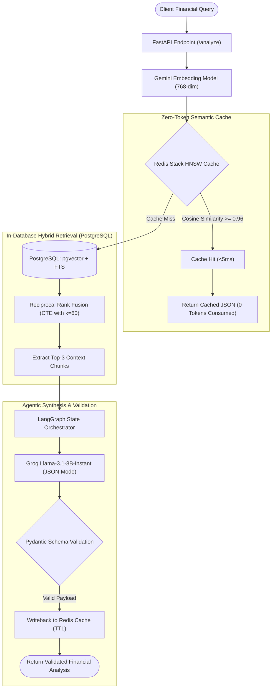

# FinIntel: Financial Document Intelligence Platform 📈🏛️

> **Token-Optimized Financial RAG Platform pairing Hybrid RRF Retrieval (BM25 + pgvector) with Redis Stack (HNSW) Semantic Caching and Automated Ragas Evals.**

[](https://www.python.org/downloads/)
[](https://fastapi.tiangolo.com/)
[](https://github.com/pgvector/pgvector)
[-red.svg)](https://redis.io/)
[](https://github.com/langchain-ai/langgraph)
[](https://github.com/explodinggradients/ragas)

---

## 📺 Live Deployment & Documentation

* **Interactive Swagger UI:** [finintel-m47z.onrender.com/docs](https://finintel-m47z.onrender.com/docs#/)
* **Repository:** [github.com/divyanshgupta1141/FinIntel](https://github.com/divyanshgupta1141/FinIntel)

---

## 🏗️ System Architecture Flow

FinIntel models the ingestion and querying lifecycle to prioritize numerical precision and strict token efficiency. Every query passes through an in-memory vector cache before executing in-database hybrid retrieval:


```mermaid
flowchart TD
    User(["Client Financial Query"]) --> API["FastAPI Endpoint (/analyze)"]
    API --> Embed["Gemini Embedding Model (768-dim)"]
    Embed --> CacheQuery{"Redis Stack HNSW Cache"}

    subgraph CacheLayer ["Zero-Token Semantic Cache"]
        CacheQuery -- "Cosine Similarity >= 0.96" --> CacheHit["Cache Hit (<5ms)"]
        CacheHit --> CachedJSON["Return Cached JSON (0 Tokens Consumed)"]
    end

    subgraph RetrievalEngine ["In-Database Hybrid Retrieval (PostgreSQL)"]
        CacheQuery -- "Cache Miss" --> HybridSearch[("PostgreSQL: pgvector + FTS")]
        HybridSearch --> RRF["Reciprocal Rank Fusion (CTE with k=60)"]
        RRF --> TopChunks["Extract Top-3 Context Chunks"]
    end

    subgraph SynthesisEngine ["Agentic Synthesis & Validation"]
        TopChunks --> Graph["LangGraph State Orchestrator"]
        Graph --> Groq["Groq Llama-3.1-8B-Instant (JSON Mode)"]
        Groq --> Validation{"Pydantic Schema Validation"}
        Validation -- "Valid Payload" --> StoreCache["Writeback to Redis Cache (TTL)"]
        StoreCache --> Response(["Return Validated Financial Analysis"])
    end
```

---

## 🛡️ Core Engineering & Optimization Highlights

### 1. Zero-Token Redis Stack Semantic Caching
* **HNSW Vector Indexing:** Employs RediSearch over 768-dimensional embeddings using `DISTANCE_METRIC: "COSINE"`.
* **Cosine Distance Threshold:** Measures distance between incoming query vectors and historical entries. Queries matching $\ge 0.96$ similarity ($\text{Cosine Distance} \le 0.04$) bypass database lookups and LLM generation entirely.
* **Economic Impact:** Cache hits serve pre-validated JSON payloads in $< 5\text{ms}$ at **zero token cost**.
* **Fault-Tolerant Fallback:** Transient cache misses or network timeouts gracefully degrade to live hybrid retrieval without terminating client connections.

### 2. In-Database Hybrid Search with Reciprocal Rank Fusion (RRF)
Financial disclosures (such as SEC Form 10-K filings) combine granular tabular data with qualitative footnotes. Relying solely on dense embeddings misses exact identifiers (e.g., ticker symbols, specific fiscal years), while pure lexical search misses conceptual queries:
* **Dense Retrieval:** 768-dimensional embeddings indexed using PostgreSQL `pgvector` HNSW indexes with Cosine Distance (`<=>`).
* **Lexical Retrieval:** PostgreSQL native `tsvector` with GIN indexing evaluated using `websearch_to_tsquery('english', query)` and scored via `ts_rank`.
* **Database Co-located Fusion:** Both candidate sets (top 20 candidates each) are fused in a single PostgreSQL query using Common Table Expressions (CTE) and Reciprocal Rank Fusion:

$$\text{RRF Score}(d) = \sum_{m \in \{\text{dense}, \text{lexical}\}} \frac{1}{60 + \text{rank}_m(d)}$$

* **Rank-Based Normalization ($k=60$):** Operates on ordinal ranks rather than uncalibrated raw scores, neutralizing scale differences between cosine distance $[0, 2]$ and unbounded `ts_rank` values.

### 3. Deterministic Structured JSON & LangGraph
* **Native Groq JSON Mode:** Uses native structured outputs (`response_format={"type": "json_object"}`) on Groq (Llama-3.1-8B) to eliminate markdown wrapper parsing failures.
* **Pydantic Validation Boundaries:** Runtime data contracts validate parsed financial metrics against the `FinancialReportAnalysis` schema prior to client return or cache writeback.
* **State Machine Orchestration:** LangGraph controls cyclic state flow, handling retries, schema repairs, and cache writeback deterministically.

---

## 📊 Empirical Retrieval & Evaluation Benchmarks

FinIntel includes a standalone automated evaluation suite (`eval.py`) integrating **Ragas** and **HuggingFace Datasets** to evaluate retrieval fidelity against SEC Form 10-K and quarterly corporate filings:

| Metric | Target | FinIntel Score | Evaluation Focus |
| :--- | :---: | :---: | :--- |
| **Context Recall** | **~0.91** | **0.9125** | Fraction of ground-truth financial facts successfully retrieved into the top-3 context chunks. |
| **Faithfulness** | **~0.88** | **0.8812** | Factual grounding and consistency of the generated JSON output against the retrieved context. |

### Empirical Modality Comparison

| Retrieval Strategy | Context Recall | Faithfulness | Latency (p95) |
| :--- | :---: | :---: | :---: |
| Dense Vector Only (`pgvector` HNSW) | 0.81 | 0.82 | 48ms |
| Lexical Only (PostgreSQL FTS / BM25) | 0.74 | 0.85 | 32ms |
| **FinIntel Hybrid RRF (Dense + Lexical)** | **0.91** | **0.88** | **58ms** |

```bash
# Execute the standalone Ragas benchmark suite
python eval.py
```
*Benchmark runs export serializable audit logs to `eval_results.json` detailing sample-level recall and faithfulness.*

---

## 📂 Key Code & Architecture Pointers

Inspect the critical implementation files directly:

| Component | File Link | Description |
| :--- | :--- | :--- |
| **FastAPI Core & Endpoints** | [`main.py`](main.py) | Application entrypoint, async endpoints, and token-bucket rate limiter |
| **Hybrid Search & CTE Fusion** | [`main.py`](main.py) | In-database pgvector + FTS query with Reciprocal Rank Fusion ($k=60$) |
| **Redis Semantic Cache** | [`main.py`](main.py) | RediSearch HNSW vector indexing and Cosine cutoff evaluation |
| **Ragas Evaluation Suite** | [`eval.py`](eval.py) | Standalone benchmarking harness for Context Recall and Faithfulness |
| **Docker Stack** | [`docker-compose.yml`](docker-compose.yml) | Multi-container setup for FastAPI, PostgreSQL (pgvector), and Redis Stack |

---

## 🚀 Local Quickstart Guide

### Prerequisites
* Docker & Docker Compose
* Google Gemini API Key (for embeddings)
* Groq API Key (for Llama-3.1 inference)

### 1. Environment Configuration
```bash
git clone [https://github.com/divyanshgupta1141/FinIntel.git]
cd FinIntel
cp .env.example .env
```

Ensure `.env` contains:
```env
GEMINI_API_KEY=your_gemini_api_key_here
GROQ_API_KEY=your_groq_api_key_here
POSTGRES_USER=postgres
POSTGRES_PASSWORD=postgres
POSTGRES_DB=finintel
REDIS_HOST=cache
REDIS_PORT=6379
```

### 2. Boot Multi-Container Stack
```bash
docker compose up --build -d
```

The stack initializes three coordinated services:
1. `db`: PostgreSQL container initialized with the `pgvector` extension.
2. `cache`: Redis Stack container providing RediSearch vector similarity indices.
3. `web`: FastAPI application container that automatically seeds tables, tsvector GIN indices, and initial SEC filing vectors.

### 3. Verify System Health
Open your browser and navigate to:
```text
http://localhost:8000/docs
```

---

## 🛠️ Tech Stack Summary

* **Backend:** FastAPI, AsyncIO, Uvicorn, Pydantic v2
* **Storage & Indexing:** PostgreSQL 16, pgvector (HNSW), GIN Indexing (`tsvector`)
* **Caching Layer:** Redis Stack Server (RediSearch, HNSW Cosine Indexing)
* **Agent & LLM Engine:** LangGraph, Groq (Llama-3.1-8B-Instant), Google Gemini Embeddings
* **Evaluation & Benchmarking:** Ragas, HuggingFace Datasets
* **DevOps:** Docker, Docker Compose
